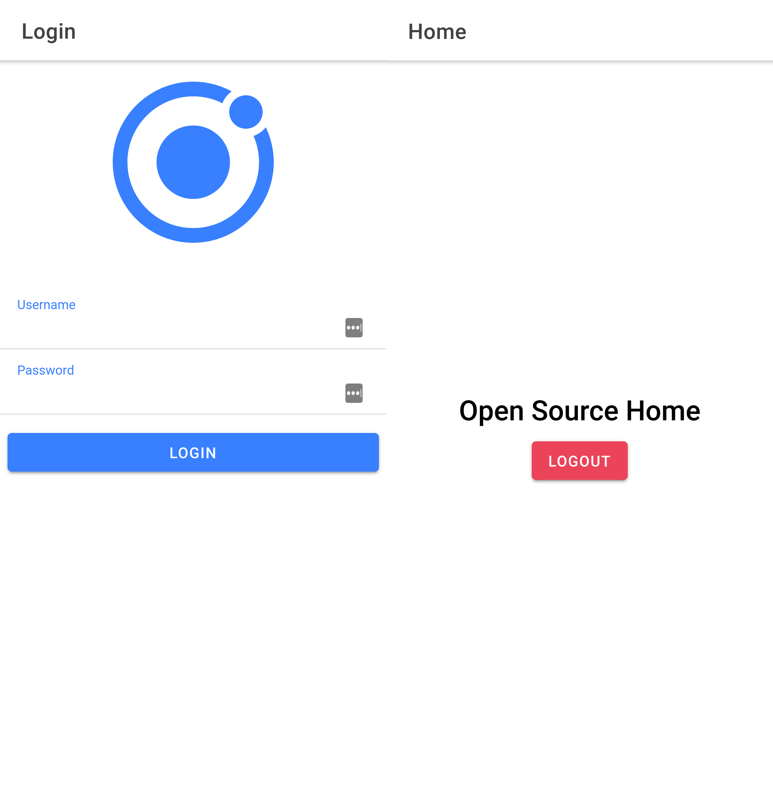
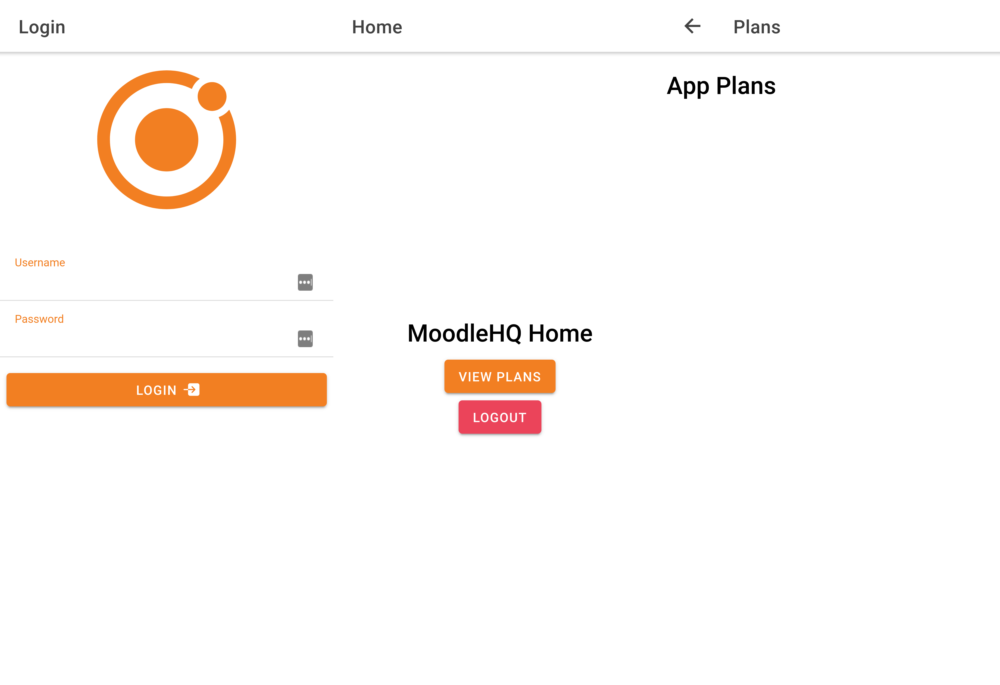
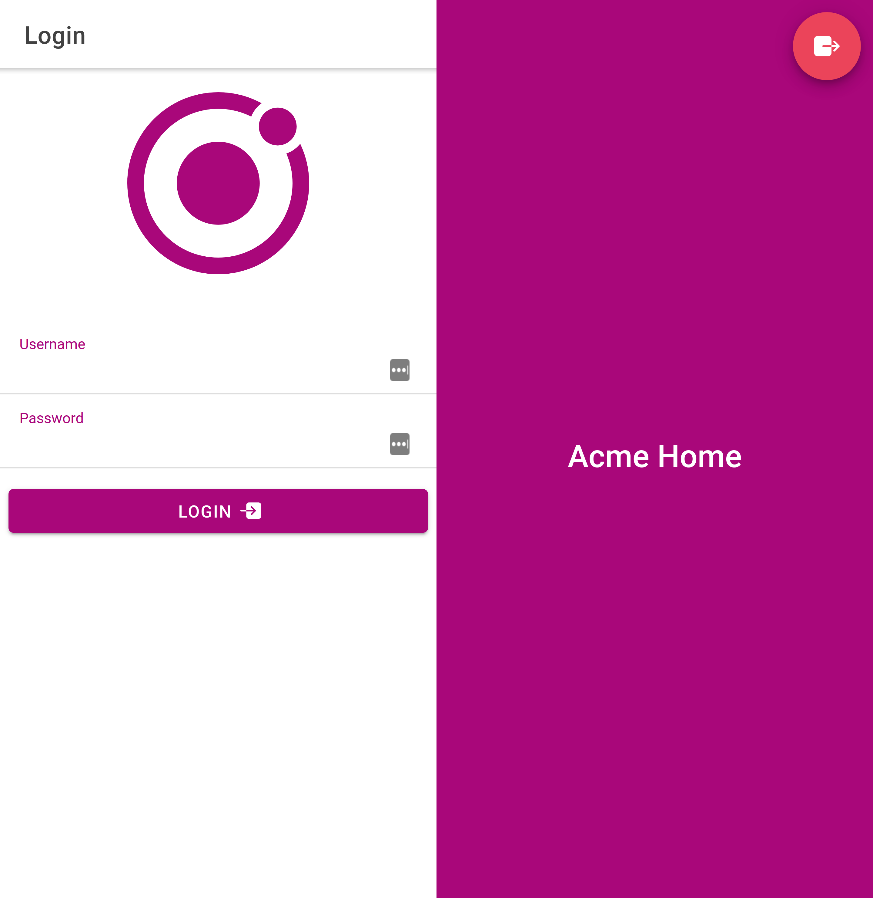

# Moodle App: Modular Architecture Proof of Concept

This is a proof of concept for an architecture that allows easier dependency management and code reuse for [Moodle Apps](https://github.com/moodlehq/moodleapp).

Table of contents:

- [Architecture](#architecture)
- [Applications in this repository](#applications-in-this-repository)
- [Use-cases](#use-cases)
- [Going further](#going-further)

## Architecture

Using this architecture, Moodle applications are standard Ionic applications, with the same folder structure and the same commands used for bundling and serving. The differences start being relevant in the root module initialization.

Ionic applications usually import the `IonicModule` along with other common modules. In this architecture, all of this is encapsulated into a Moodle App Module. This allows creating lean applications that only contain code relevant to customization and extension. Following this approach, the main mechanism of code reuse is [Angular NgModules](https://angular.io/guide/ngmodules) bundled in npm packages.

For these purposes, the code of applications that are made to be extensible consist of two [Angular projects](https://angular.io/guide/glossary#project) together: a library and an application. The library includes the code that is bundled into an npm package, using [ng-packagr](https://github.com/ng-packagr/ng-packagr). The application code is written like any other extended application; importing the Moodle App Module from the library code. In the examples in this repository the library code is always encapsulated in the `src/lib/` folder. But it could be mixed with the application code, the only requirement is to have different entry files (`src/main.ts` and `src/lib/index.ts` in this case).

With this paradigm, extension and customization are possible but don't come for free. Rigid code that is tightly coupled will continue to be so, so the [Open-Closed Principle](https://en.wikipedia.org/wiki/Open%E2%80%93closed_principle) becomes more relevant in this context. The good news is that this allows for a progressive migration of the codebase, refactoring for extension the parts that need it.

## Applications in this repository

There are 3 applications in this repository:

- **moodle-app**: An app analogous to the [open source app](https://github.com/moodlehq/moodleapp).

  

    
Screenshots

    
  

  This is the parent application and doesn't extend from any other. It defines the root [Moodle App Module](#architecture).

  It has two services: Auth and Users. The Auth service manages the authentication state in the application. The Users service manages existing users, and it is the one that would normally communicate with a server.

  It has two pages: Login and Home. The Login page contains a login form with an icon, two inputs (username & password) and a submit button. The Home page contains some text and a logout button.

  For this demo, the Users service has a single user registered with username "johndoe". The password is not validated.

- **moodlehq**: An app analogous to [Moodle HQ's app](https://moodle.com/app/).

  

    
Screenshots

    
  

  This extends from `moodle-app` and defines its own branding color.

  It overrides the Home page and declares a new one called Plans. The Home page looks mostly the same as the default, with the addition of a button that opens the Plans page. The Plans page only contains text. The icon asset that's displayed on the Login page is also overriden.

  The Login page is extended from `moodle-app`, instead of being overriden completely. The only thing that's changed is the submit button, which contains an icon to show the difference visually.

  The Users service is extended from `moodle-app`, adding a new user with username "student".

- **acme**: An app analogous to [a branded app](https://moodle.com/branded-app/).

  

    
Screenshots

    
  

  This extends from `moodlehq` and it defines its own branding color.

  It overrides the Home page with a branded background and a floating action button for logout. The icon asset displayed on the Login page is also overriden.

  The Users service is extended from `moodlehq`, adding a new user with username "admin".

## Use-cases

Here are some common use-cases and what they look like using this architecture:

- [Creating a new application](#creating-a-new-application)
- [Making an application extensible](#making-an-application-extensible)
- [Overriding Pages and Routes](#overriding-pages-and-routes)
- [Extending a Page instead of overriding](#extending-a-page-instead-of-overriding)
- [Overriding application components](#overriding-application-components)
- [Overriding Services](#overriding-services)
- [Overriding Assets](#overriding-assets)

### Creating a new application

In order to create a new application, the standard tools can be used to create a blank Ionic application. Once that is done, most of the Ionic boilerplate can be removed given that it'll be included by the Moodle App Module.

[This commit](https://github.com/NoelDeMartin/moodle-app-modular-architecture-poc/commit/aa7b540b03e0bbf9974687d218ef8feb847542fd) is an example of what doing that looks like. Pay special attention to the `src/` directory, which is quite lean compared with a blank Ionic app.

### Making an application extensible

This is not something that should happen often, given that most applications will be "final" (meaning they cannot be extended). When possible, [composition should be favored over inheritance](https://en.wikipedia.org/wiki/Composition_over_inheritance). But sometimes it'll be necessary.

In these situations, the reusable code of the application must be encapsulated in a library [Angular project](https://angular.io/guide/glossary#project). In the examples on this repository this meant moving the files to a `src/lib/` folder, but it could simply be adding a new entry point exporting the appropriate classes and declaring the project.

However, it is recommended to both encapsulate the code and rename the modules. When an application is not extensible, it's fine to have a module called "AppRouting". But once that becomes available to other projects, it may be better to prefix it with the application name. For example "MoodleAppRouting".

This is arguable given that most modules won't be referenced by name though, but it's important to at least think about.

[This commit](https://github.com/NoelDeMartin/moodle-app-modular-architecture-poc/commit/08b70655d4da1a088f3656f4ec4bf98c0513fce0) is an example of what doing that looks like.

### Overriding Pages and Routes

If you want to replace existing pages, or create your own, you can use nearly the same pattern that you would use in a standard Ionic application.

An injection token named `MOODLE_ROUTES` is exposed from `moodle-app`, and route arrays can be injected to extend the default behaviour. This will allow you to add new routes and replace existing ones with custom content. With some syntactic sugar, it would be possible to use the exact same pattern that's used in Angular applications and load your routes calling `MoodleAppRouterModule.forRoot`. That's exactly what's happening in [Angular's RouterModule](https://github.com/angular/angular/blob/10.0.14/packages/router/src/router_module.ts#L217).

[Here's one example](https://github.com/NoelDeMartin/moodle-app-modular-architecture-poc/blob/main/acme/src/app/app-routing.module.ts) of how to do that.

### Extending a Page instead of overriding

Sometimes, we only want to extend a page instead of overriding it completely. This is unfortunately not straightforward, although doing more research this could be improved.

There is [an example](https://angular.io/guide/dependency-injection-in-action#inject-into-a-derived-class) in the Angular docs about extending a component, and it shows how it's not possible to reuse the template. Because of this, the best strategy I could think of is to break a page into relevant sections and reuse those components to override slots. [Angular doesn't support default content for slots](https://github.com/angular/angular/issues/12530), so this becomes cumbersome. The good news is that this complexity is encapsulated in the library, and we don't have this problem in the component class.

You can see an example of this comparing [the default login page](https://github.com/NoelDeMartin/moodle-app-modular-architecture-poc/blob/main/moodle-app/src/lib/pages/login/login.page.html) with [its counterpart in the moodlehq app](https://github.com/NoelDeMartin/moodle-app-modular-architecture-poc/blob/main/moodlehq/src/lib/app/login/login.page.html), that overrides only the submit button.

### Overriding application components

I haven't found a decent way to override application level components, but that may be an indication that it shouldn't be done. Instead, components should be customized using CSS variables and functionality that's relevant to the application should be delegated to a Service (which is easy to override).

When I started this project, what I had in mind was using dynamic components. That would certainly solve the problem, but at the cost of losing a lot of clarity in the templates and complicating the code.

In the customizations I've wanted to do in this repository, using CSS variables has sufficed. And it's always possible to [extend a page](#extending-a-page-instead-of-overriding) to replace a specific component.

It's likely that this comes up in the future again, so we can revisit it with a specific use-case in mind.

### Overriding Services

This is perhaps the easiest thing to do, you only need to extend the base class and provide it using the parent's injection token.

[This commit](https://github.com/NoelDeMartin/moodle-app-modular-architecture-poc/commit/05ac2b585a5bf1829a5e5a4edc427c1134bd3b2e) is an example of overriding the `UsersService`.

### Overriding Assets

In some ocassions, assets are directly referenced by url and that cannot be intercepted by Angular's NgModules system. For this reason, this must be configured in the bundler.

In the examples in this repository, you will see in the [angular.json](https://github.com/NoelDeMartin/moodle-app-modular-architecture-poc/blob/main/acme/angular.json) files that assets are taken from multiple sources. This can also be improved, but it's a decent first approach if we assume that applications inheritance chains won't be too long.

One asset that's been customized for the 3 applications in this repository is the `src/assets/icon.svg` (or `src/lib/assets/icon.svg`). These assets are included in the npm package by the following script that gets called during the bundling process: [prepare-lib-assets.js](https://github.com/NoelDeMartin/moodle-app-modular-architecture-poc/blob/main/moodle-app/scripts/prepare-lib-assets.js).

## Going further

Here's a couple of issues that remain open or unexplored.

### Tree-shaking

Initially, I was using tree-shaking for route components. But it proved too difficult given one [existing issues in ng-packager](https://github.com/ng-packagr/ng-packagr/issues/1285).

I suppose this could be circumvented by using a different alternative to bundling. But given that this application is targeted at mobile devices, tree-shaking may not be that important.

### Npm modules and versioning

In this repository npm dependencies are declared with `"moodle-app": "file:../moodle-app/dist/"` in `package.json`, but this hasn't actually worked when running `npm install`. I solved it by copying the package manually into `node_modules`, but this is of course not maintainable.

This can be solved by publishing the packages to npm, but that will come with additional challenges like managing private npm packages and versioning.

### Native code

In the example applications of this repository it hasn't been necessary to implement any native code or install cordova/capacitor plugins. However, that is likely to happen and it hasn't been explored how to reuse that code as well.

It can probably be done bundling native code as assets, and hooking into Ionic build system to publish it. This is already something that's happening with Ionic native code, but it'll depend on how flexible the build process is.
